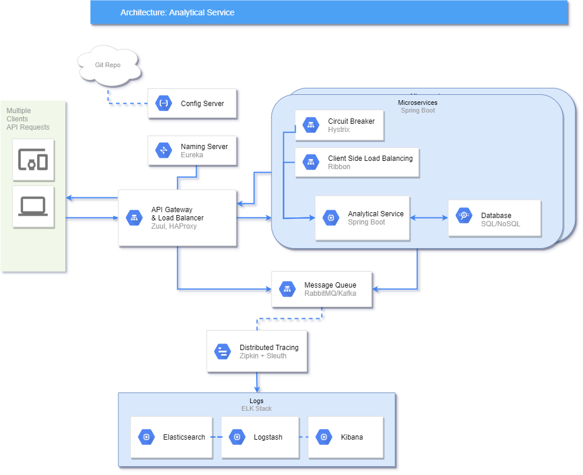

# System Design
## Design Question:
Design A Google Analytic like Backend System. We need to provide Google Analytic like services to our customers. Pls provide a high level solution design for the backend system. Feel free to choose any open source tools as you want.

The system needs to:

1. handle large write volume: Billions write events per day.

2. handle large read/query volume: Millions merchants want to get insight about their business. Read/Query patterns are time-series related metrics.

3. provide metrics to customers with at most one hour delay.

4. run with minimum downtime.

5. have the ability to reprocess historical data in case of bugs in the processing logic.

## Requirement Analysis
- Billions of write/read event per day means system have to be highly scalable. Able to run as a distributed application on multiple servers and databases.
- To achieve that, cloud based system design with load balancing is a neccessity.
- All key metrics have to be identified and monitored at all levels. Metrics data 
In this case, microservices architecture is preferrable instead of monolith. System needs to be highly scalable with proper load balancing and implemented with CI/CD to reduce delivery downtime.
- In order to run with minimum downtime, a proper health monitoring and failover system have to be implemented. Continuous Deployment will also need to be implemented to minimize deployment downtime.
- Logging needs to be scalable and easily accessible.
- Each analytical process will have to be stored in a database (SQL/NoSQL or even big data tools) with proper state snapshotting so the system will be able to reprocess historical data.

## Overview

[Diagram made with draw.io](https://drive.google.com/file/d/1J5Y8y8TPO6QKDSAG7BIAIzRztaWynWIL/view?usp=sharing)

## Details
### Microservices (Distributed Systems)
- In this case, microservices architecture is preferrable instead of monolith. 
- System needs to be highly scalable with proper load balancing.
- Implemented with CI/CD to reduce delivery downtime.

### Zuul
- API gateway with dynamic routing, monitoring, resiliency, and security.
- Easy implementation with Spring Boot and Spring Cloud.

### HAProxy
- Provides a high availability load balancer and proxy server for TCP and HTTP-based applications that spreads requests across multiple servers.
- Combined with Zuul to provide layer 7 load balancing.

### Eureka
- Naming server which holds all the IP and port of each services.
- Provides service discovery to allow services to communicate with each other without knowing their hostname and port.

### Config Server
- Holds application configs needed by other services.
- Read from a dedicated git repository for seamless modification.

### RabbitMQ
- Lightweight message broker with high scaling and high availability.

### Zipkin and Sleuth
- Provides real time tracing of every request made across multiple services and servers.
- Spring Sleuth add unique traceable ID to each request.
- Zipkin is mainly used to gather performance and help troubleshoot latency problems.

### ELK Stack
- Widely used logging stack consists of three open-source tools.
- Provide easily searchable logs with visualization.

### Hystrix
- Tool to implement Circuit Breaker pattern which acts as a failsafe to protect the system.

### Ribbon
- Combined with Eureka, provides client side load balancing which each client has responsibility for which server to pick from.

### Spring Boot
- Easy Spring project initialization.
- I choose this because I'm most familiar with this framework.

### Database
- Both SQL/NoSQL should be acceptable in this case.
- Though NoSQL is preferrable due to flexibility of the data schema.
- The metrics data will also require a lot of text mining which works best with NoSQL.
